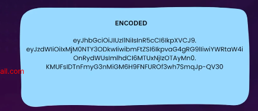

JWT --> JSON Web Token
  - A small digital token used to verify a user's identity and safely share information between a server and a client.

This is how it looks...
  

  It is divided in three section.
    -JWT Header:
                ENCODED:                               DECODED:
    eyJhbGciOiJIUzqn22knalascasnvsu2                {
                                                        "alg":"HS256",
                                                        "typ":"JWT"
                                                    }

    -JWT PAYLOAD
                ENCODED:                               DECODED:
    eyJ2dWIiOixMjMONTY3ODkwliwibmFtZsi61            {
     kpvaG4gRGolliwiyWRtaw4ionkydWUsim                  "id":"123456789"
            hd CIEMTUxNjZOTAyMnO                        "name": "John Doe"
                                                        "email": "john@doe.com"
                                                        "role": admin
                                                        "iat": 15134535195
                                                    }

    -JWT SIGNATURE
                ENCODED:                               DECODED:
    KMUFsIDTnFmyG3nMiGM6H9FNFUROI3wh                HMACSHA256(
               Tsmqup-QV30                          basesaurlencode(header) +"."+
                                                    base64Urlencode(payload),
                                                    secretkey
                                                    )

Authentication Process:

 client                        using secret key on Server
Payload ------> Authenticate ------> Generate JWT ------> Response with JWT
Payload <------------------------------------------------ Response with JWT

